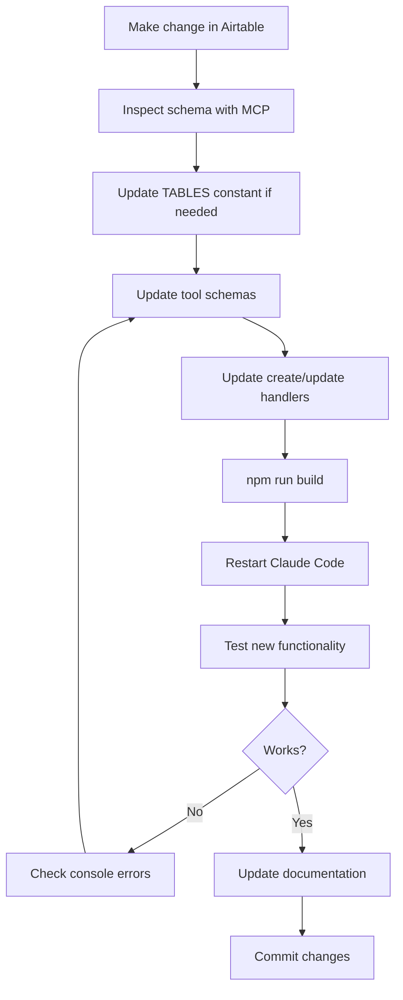

# Airtable MCP Server - Maintenance Guide

**Purpose:** Keep the MCP server synchronized with your Airtable base as you add or change fields and tables.

## Quick Reference

### When to Update the MCP Server

Update the MCP server when you:
- ✅ Add a new field to an existing table
- ✅ Rename a field in a table
- ✅ Add a new table
- ✅ Change field types (e.g., text to select)
- ✅ Want to add CRUD operations for a table

### When You DON'T Need to Update

You do NOT need to update when you:
- ❌ Add or delete records (data changes)
- ❌ Change field values
- ❌ Modify views or filters
- ❌ Update formulas or rollups

---

## New Introspection Tools

The MCP server now includes two powerful introspection functions to help you discover and verify schema changes:

### 1. List All Tables

```typescript
list_all_tables()
```

**What it does:**
- Shows all tables currently configured in the MCP server
- Displays the constant name and actual table name
- Helps you verify table names are correct

**When to use:**
- Before inspecting a specific table
- To see what tables are available
- After adding a new table constant

### 2. Inspect Table Schema

```typescript
inspect_table_schema({
  table_name: "Tasks",
  max_records: 5  // optional, default is 5
})
```

**What it does:**
- Fetches sample records from the table
- Analyzes and displays all field names
- Shows field types (string, number, array, etc.)
- Provides sample values for each field
- Generates code snippets for field access

**When to use:**
- After adding new fields to a table
- To verify field names and types
- Before updating CRUD functions
- To troubleshoot field name errors

**Output includes:**
- Complete field list with types
- Sample records in JSON format
- Code snippets for field access
- Field name mapping for create/update operations

---

## Step-by-Step Update Workflow

### Scenario 1: Adding a New Field to an Existing Table

**Example:** Adding "Due Date" and "Status" fields to the Tasks table

#### Step 1: Add Fields in Airtable
1. Open your Airtable base
2. Go to the Tasks table
3. Add new fields:
   - "Due Date" (Date field)
   - "Status" (Single Select: "To Do", "In Progress", "Completed")

#### Step 2: Inspect the Updated Schema
```bash
# In Claude Code, run:
inspect_table_schema({ table_name: "Tasks" })
```

This will show you:
- All field names (including new ones)
- Field types
- Sample values

#### Step 3: Update CRUD Functions

Open `src/index.ts` and locate the create/update functions for Tasks:

**Before (create_task):**
```typescript
case 'create_task': {
  const fields: any = {
    Name: (args as any).name,
  };

  if ((args as any).category) {
    fields.Category = (args as any).category;
  }
  // ... rest of code
}
```

**After (with new fields):**
```typescript
case 'create_task': {
  const fields: any = {
    Name: (args as any).name,
  };

  if ((args as any).category) {
    fields.Category = (args as any).category;
  }
  if ((args as any).due_date) {
    fields['Due Date'] = (args as any).due_date;  // Note: use bracket notation for spaces
  }
  if ((args as any).status) {
    fields.Status = (args as any).status;
  }
  // ... rest of code
}
```

#### Step 4: Update Tool Schema

Update the tool definition to include new parameters:

**Before:**
```typescript
{
  name: 'create_task',
  description: 'Create a new task',
  inputSchema: {
    type: 'object',
    properties: {
      name: {
        type: 'string',
        description: 'Task name (required)',
      },
      category: {
        type: 'string',
        description: 'Task category',
      },
    },
    required: ['name'],
  },
}
```

**After:**
```typescript
{
  name: 'create_task',
  description: 'Create a new task',
  inputSchema: {
    type: 'object',
    properties: {
      name: {
        type: 'string',
        description: 'Task name (required)',
      },
      category: {
        type: 'string',
        description: 'Task category',
      },
      due_date: {
        type: 'string',
        description: 'Due date in YYYY-MM-DD format',
      },
      status: {
        type: 'string',
        description: 'Task status: To Do, In Progress, Completed',
      },
    },
    required: ['name'],
  },
}
```

#### Step 5: Update the Update Function

Do the same for `update_task`:

```typescript
case 'update_task': {
  const recordId = (args as any).record_id;
  const fields: any = {};

  if ((args as any).name) fields.Name = (args as any).name;
  if ((args as any).category) fields.Category = (args as any).category;
  if ((args as any).due_date) fields['Due Date'] = (args as any).due_date;
  if ((args as any).status) fields.Status = (args as any).status;

  const updatedRecord = await base(TABLES.TASKS).update(recordId, fields);
  // ... rest of code
}
```

#### Step 6: Rebuild and Restart
```bash
cd airtable-mcp-server
npm run build
```

Then restart Claude Code.

#### Step 7: Test
```typescript
// Test creating a task with new fields
create_task({
  name: "Complete quarterly report",
  category: "Work",
  due_date: "2026-02-01",
  status: "To Do"
})

// Test updating
update_task({
  record_id: "recXXXXXX",
  status: "In Progress"
})
```

---

### Scenario 2: Adding a New Table

**Example:** Adding a "Notes" table for quick note-taking

#### Step 1: Create Table in Airtable
1. Add new table called "Notes"
2. Add fields:
   - Name (Title field)
   - Content (Long text)
   - Created Date (Date)
   - Tags (Multiple select)

#### Step 2: Add Table Constant

In `src/index.ts`, add to the TABLES constant:

```typescript
const TABLES = {
  DAY: 'Day',
  WEEK: 'Week',
  CALENDAR_EVENTS: 'Calendar Events',
  TASKS: 'Tasks',
  NOTES: 'Notes',  // ADD THIS LINE
  // ... rest of tables
};
```

#### Step 3: Inspect the Schema
```typescript
inspect_table_schema({ table_name: "Notes" })
```

Review the output to understand the field structure.

#### Step 4: Add Read Function

Add a tool definition:

```typescript
{
  name: 'get_notes',
  description: 'Get all notes or search by content',
  inputSchema: {
    type: 'object',
    properties: {
      search: {
        type: 'string',
        description: 'Search term for note content or name',
      },
      limit: {
        type: 'number',
        description: 'Maximum number of notes to return (default: 50)',
        default: 50,
      },
    },
  },
}
```

Add the handler:

```typescript
case 'get_notes': {
  const search = (args as any)?.search;
  const limit = (args as any)?.limit ?? 50;

  let formula = '';
  if (search) {
    formula = `OR(FIND(LOWER('${search}'), LOWER({Name})), FIND(LOWER('${search}'), LOWER({Content})))`;
  }

  const selectOptions: any = { maxRecords: limit };
  if (formula) {
    selectOptions.filterByFormula = formula;
  }

  const records = await base(TABLES.NOTES).select(selectOptions).all();

  return {
    content: [
      {
        type: 'text',
        text: formatRecords(records),
      },
    ],
  };
}
```

#### Step 5: Add CRUD Functions

Following the patterns from Tasks/Meals/Events, add:
- `create_note`
- `update_note`
- `delete_note`

See the existing implementations as templates.

#### Step 6: Rebuild, Restart, Test

```bash
npm run build
```

Restart Claude Code, then test:

```typescript
create_note({
  name: "Meeting Ideas",
  content: "Discussion points for next team meeting...",
  tags: ["work", "meetings"]
})
```

---

### Scenario 3: Renaming a Field

**Example:** Renaming "Category" to "Project" in Tasks table

#### Step 1: Rename in Airtable
1. Open Tasks table
2. Click the "Category" field header
3. Rename to "Project"

#### Step 2: Inspect Schema
```typescript
inspect_table_schema({ table_name: "Tasks" })
```

Verify the field is now called "Project".

#### Step 3: Update All References

Search for all instances of "Category" in `src/index.ts`:

**In create_task:**
```typescript
// OLD
if ((args as any).category) {
  fields.Category = (args as any).category;
}

// NEW
if ((args as any).project) {
  fields.Project = (args as any).project;
}
```

**In update_task:**
```typescript
// OLD
if ((args as any).category) fields.Category = (args as any).category;

// NEW
if ((args as any).project) fields.Project = (args as any).project;
```

**In tool schemas:**
```typescript
// OLD
category: {
  type: 'string',
  description: 'Task category',
}

// NEW
project: {
  type: 'string',
  description: 'Task project',
}
```

#### Step 4: Update Documentation

Update FIELD_MAPPING.md and CRUD_OPERATIONS.md to reflect the change.

#### Step 5: Rebuild, Restart, Test

---

## Field Name Handling

### Fields with Spaces

Airtable field names often have spaces. Use bracket notation:

```typescript
// Correct
fields['Due Date'] = '2026-01-27';
fields['Start Time'] = '2026-01-27T10:00:00.000Z';

// Incorrect (will cause errors)
fields.Due Date = '2026-01-27';  // Syntax error
```

### Fields with Special Characters

```typescript
// Spaces
fields['Meal Type'] = 'Breakfast';

// Parentheses
fields['Duration (min)'] = 60;

// Hyphens
fields['Follow-up Date'] = '2026-01-27';
```

### Simple Field Names

For fields without spaces or special characters, both work:

```typescript
// Both are fine
fields.Name = 'Task name';
fields['Name'] = 'Task name';
```

---

## Common Pitfalls and Solutions

### Pitfall 1: Field Name Typo

**Error:** `Unknown field name: "Catagory"`

**Solution:**
1. Run `inspect_table_schema({ table_name: "Tasks" })`
2. Find the correct spelling: "Category"
3. Update your code

### Pitfall 2: Wrong Table Name

**Error:** `Table not found: "Task"`

**Solution:**
1. Run `list_all_tables()`
2. Check the exact table name: "Tasks" (plural)
3. Use the correct name

### Pitfall 3: Missing Table Constant

**Error:** `TABLES.NOTES is undefined`

**Solution:**
1. Add the constant to the TABLES object:
   ```typescript
   const TABLES = {
     // ... existing tables
     NOTES: 'Notes',
   };
   ```

### Pitfall 4: Wrong Field Type

**Error:** Airtable rejects the value

**Solution:**
1. Run `inspect_table_schema()` to see the field type
2. Match your value to the type:
   - Date fields: "YYYY-MM-DD"
   - DateTime fields: ISO 8601 format
   - Number fields: Use numbers, not strings
   - Arrays: `["value1", "value2"]`
   - Links: `["recXXX", "recYYY"]`

### Pitfall 5: Forgot to Rebuild

**Error:** New functions don't appear in Claude Code

**Solution:**
1. Always run `npm run build` after code changes
2. Restart Claude Code completely
3. Verify the build succeeded (no TypeScript errors)

---

## Testing Checklist

After making changes, test:

- [ ] `list_all_tables()` - Shows new table if added
- [ ] `inspect_table_schema({ table_name: "Your Table" })` - Displays all fields correctly
- [ ] Create operation - Successfully creates record with new fields
- [ ] Update operation - Successfully updates new fields
- [ ] Read operation - Returns records with new fields
- [ ] Delete operation - Still works (should be unaffected)

---

## Automation Opportunities

### Script to Generate CRUD Functions

Create a script that:
1. Inspects a table schema
2. Generates create/update/delete functions
3. Generates tool definitions
4. Outputs code to copy/paste

**Future enhancement:** This could be built into the MCP server itself.

### Schema Diff Tool

Create a tool that:
1. Saves current schema to a file
2. Compares against saved schema on next run
3. Reports what changed (new fields, renamed fields, etc.)

### Auto-Documentation

Script to:
1. Inspect all tables
2. Generate updated FIELD_MAPPING.md automatically
3. Ensure documentation stays current

---

## Best Practices

### 1. Always Inspect Before Updating

```bash
# Before making code changes
inspect_table_schema({ table_name: "Tasks" })
```

Review the schema to understand:
- Exact field names (including capitalization and spaces)
- Field types
- Sample values

### 2. Test with Sample Data First

Before using new fields in production:
1. Create a test record manually
2. Inspect the schema to see how it's stored
3. Update your code
4. Test with the MCP functions

### 3. Update Documentation

When you add/change fields:
1. Update FIELD_MAPPING.md
2. Update CRUD_OPERATIONS.md
3. Add examples for new fields
4. Document any special handling required

### 4. Version Control

Commit changes after:
- Adding new tables
- Adding new fields
- Major schema changes

This lets you revert if needed.

### 5. Keep a Schema Changelog

Document schema changes:

```markdown
## Schema Changelog

### 2026-01-27
- Added "Due Date" and "Status" fields to Tasks table
- Updated create_task and update_task functions
- Updated tool schemas

### 2026-01-28
- Added "Notes" table with CRUD operations
- Added Tags field (multiple select)
```

---

## Quick Reference: Update Workflow



---

## Emergency Troubleshooting

### Everything is Broken

1. Check TypeScript build:
   ```bash
   cd airtable-mcp-server
   npm run build
   ```

2. If build fails, fix TypeScript errors first

3. If build succeeds, check Claude Code MCP config

4. Restart Claude Code completely

5. Test with `list_all_tables()` to verify MCP is working

### Specific Field Not Working

1. Inspect the table:
   ```typescript
   inspect_table_schema({ table_name: "Your Table" })
   ```

2. Copy the exact field name from the output

3. Update your code with the exact name (case-sensitive, spaces matter)

4. Rebuild and restart

### New Table Not Appearing

1. Verify table name:
   ```typescript
   list_all_tables()
   ```

2. Check if constant was added to TABLES object

3. Check if handler case was added

4. Rebuild and restart

---

## Summary

**Key Tools:**
- ✅ `list_all_tables()` - See all configured tables
- ✅ `inspect_table_schema()` - Discover field names and types

**Update Process:**
1. Change in Airtable → 2. Inspect schema → 3. Update code → 4. Rebuild → 5. Restart → 6. Test

**Remember:**
- Always use exact field names (case-sensitive, spaces matter)
- Use bracket notation for fields with spaces
- Rebuild after every code change
- Restart Claude Code after rebuilding
- Test before considering it done

Your MCP server will stay in sync with your Airtable base if you follow this workflow consistently!
